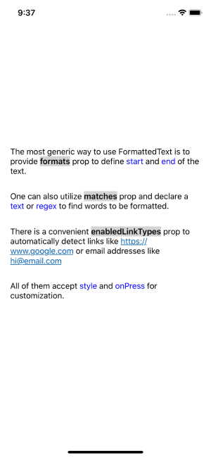

# react-native-formatted-text

An easy way to dynamically add text format in react native

* Provides multiple approaches to locate text needs to be formatted
* Easy to customize with any valid Text styles
* Automatically detect and handle link or email in the string 

## Example
 

[examples/App.js](examples/App.js)

## Installation
If using yarn:

```
yarn add react-native-formatted-text
```

If using npm:

```
npm i react-native-formatted-text
```

## Usage
```jsx
import { FormattedText } from 'react-native-formatted-text';
```

Simply wrap the text in `FormattedText` tags. You may use `ranges` prop and to declare `start` and `end` index of the text.

```jsx
<FormattedText ranges={{start: 6, end: 12, style: {color: 'red'}}}>
  Hello, World!
</FormattedText>
```

Another way is to use `matches` and provide a `text` or `regex` value.

```jsx
<FormattedText
  matches={[
    {text: 'Hello', style: {color: 'red'}},
    {regex: /World/g, style: {color: 'blue'}},
  ]}>
  Hello, World!
</FormattedText>
```

Both `ranges` and `matches` accept Object for a single lookup or array for multiple setups.

## Documentation

### Base props

| Name             | Description                                     | Default      | Type            |
| ---------------- | ----------------------------------------------- | ------------ | --------------- |
| ranges           | Declares matching range                         | []           | Array or Object of Range |
| matches          | Provides text or regex value for string matches | []           | Array or Object of Match |
| enabledLinkTypes | Enables automatic link checking                 | []           | Array or Object of LinkMatch |

### Range Object
| Name        | Description                                         |  Type        |  
| ----------- | --------------------------------------------------- | ------------ |
| start       | Defines start index of text to format, inclusive    | Int          |
| end         | Defines end index of text to format, exclusive      | Int          |
| style       | Provides format style, can use any valid Text style | Object       |
| onPress     | Defines the function of press event                 | Func         |

### Match Object
| Name        | Description                                         |  Type        |  
| ----------- | --------------------------------------------------- | ------------ |
| text        | Defines the text to format                          | Int          |
| regex       | Provides a regex to find text to format             | Int          |
| style       | Provides format style, can use any valid Text style | Object       |
| onPress     | Defines the function of press event                 | Func         |

### Link Match Object
| Name        | Description                                         |  Type                     |  
| ----------- | --------------------------------------------------- | ------------------------- |
| type        | Set a link type to format                           | FORMATTED_LINK_MATCH_TYPE |
| style       | Provides format style, can use any valid Text style | Object                    |
| onPress     | Defines the function of press event                 | Func                      |

## Contributing

Pull requests are always welcome! Feel free to open a new GitHub issue for any changes that can be made.

## Author

Xiao Ma

## Roadmap
- Allow range overlapping
- A more flexible `matches` approach that allows to format all matched text or ones before/after certain index
- Provide a way to customize press feedback UI
- Add more link detection type

## License

[MIT](./LICENSE)
